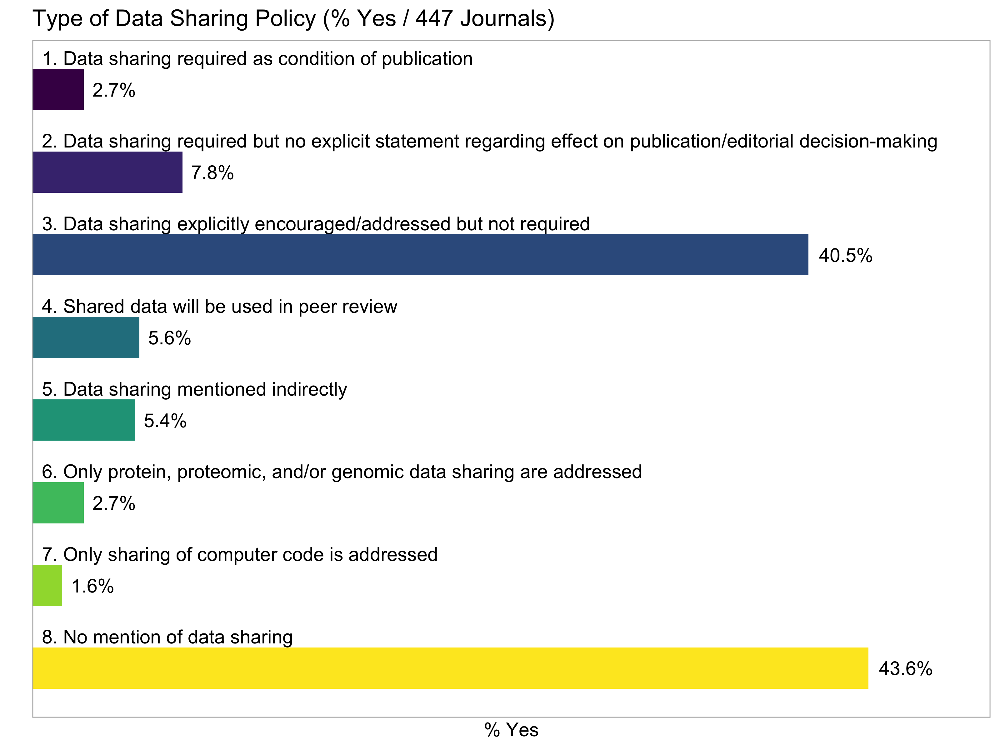
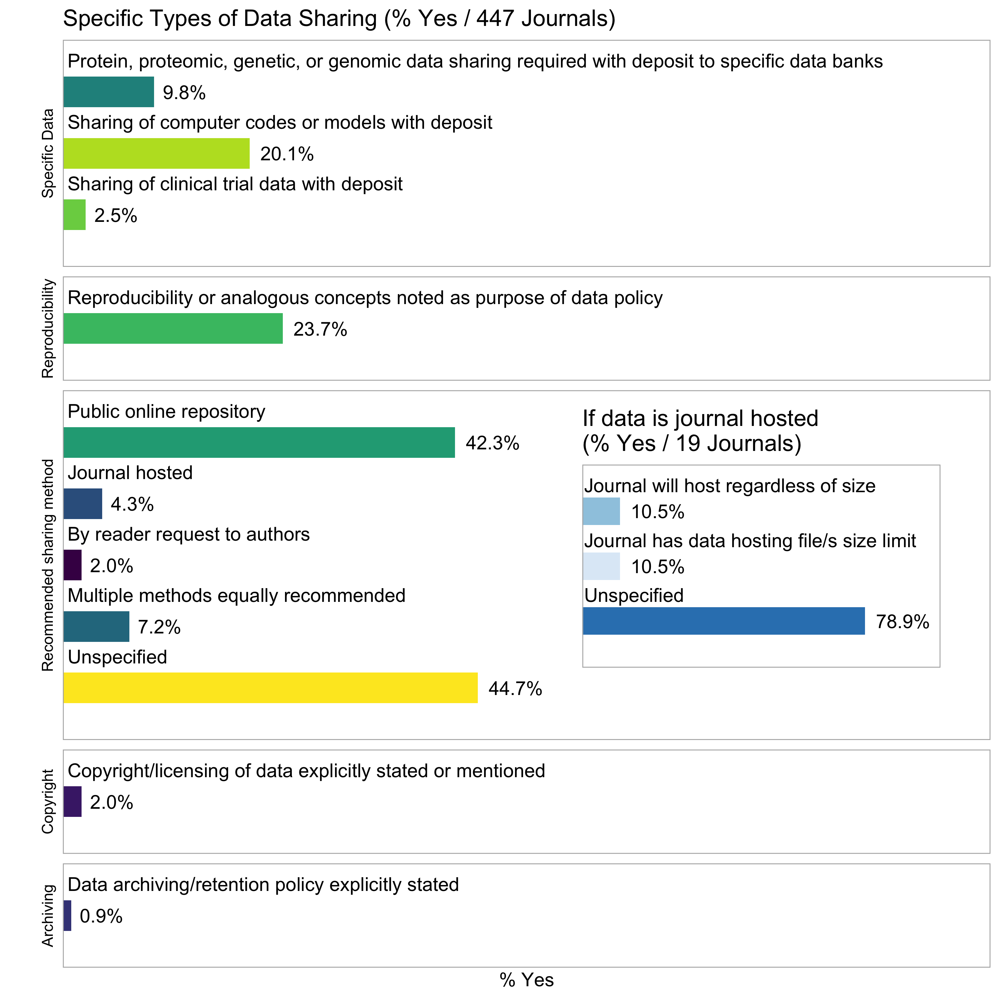

Analysis - Data Sharing Policies
================

-   [Table 1](#table-1)
-   [Table 2](#table-2)
-   [Table 3](#table-3)
    -   [Table 3 Plot](#table-3-plot)

``` r
alldata <- read_excel(here("data","RawData_Reviewed_by_NV.xlsx"),sheet="All data",skip = 1,na = c("","NA"))
alldata %<>% clean_names()
```

Table 1
=======

``` r
alldata %>% tabyl(typeof_science) %>% 
  adorn_pct_formatting() %>%
  adorn_totals() %>%
  kable(format="html")  %>%
  kable_styling("striped")
```

<table class="table table-striped" style="margin-left: auto; margin-right: auto;">
<thead>
<tr>
<th style="text-align:left;">
typeof\_science
</th>
<th style="text-align:right;">
n
</th>
<th style="text-align:left;">
percent
</th>
</tr>
</thead>
<tbody>
<tr>
<td style="text-align:left;">
B
</td>
<td style="text-align:right;">
81
</td>
<td style="text-align:left;">
18.1%
</td>
</tr>
<tr>
<td style="text-align:left;">
C
</td>
<td style="text-align:right;">
84
</td>
<td style="text-align:left;">
18.8%
</td>
</tr>
<tr>
<td style="text-align:left;">
M
</td>
<td style="text-align:right;">
97
</td>
<td style="text-align:left;">
21.7%
</td>
</tr>
<tr>
<td style="text-align:left;">
P
</td>
<td style="text-align:right;">
89
</td>
<td style="text-align:left;">
19.9%
</td>
</tr>
<tr>
<td style="text-align:left;">
S
</td>
<td style="text-align:right;">
96
</td>
<td style="text-align:left;">
21.5%
</td>
</tr>
<tr>
<td style="text-align:left;">
Total
</td>
<td style="text-align:right;">
447
</td>
<td style="text-align:left;">
-   </td>
    </tr>
    </tbody>
    </table>

``` r
alldata %>% tabyl(open_access) %>% 
  adorn_pct_formatting() %>%
  adorn_totals() %>%
  kable(format="html")  %>%
  kable_styling("striped")
```

<table class="table table-striped" style="margin-left: auto; margin-right: auto;">
<thead>
<tr>
<th style="text-align:left;">
open\_access
</th>
<th style="text-align:right;">
n
</th>
<th style="text-align:left;">
percent
</th>
</tr>
</thead>
<tbody>
<tr>
<td style="text-align:left;">
0
</td>
<td style="text-align:right;">
394
</td>
<td style="text-align:left;">
88.1%
</td>
</tr>
<tr>
<td style="text-align:left;">
1
</td>
<td style="text-align:right;">
53
</td>
<td style="text-align:left;">
11.9%
</td>
</tr>
<tr>
<td style="text-align:left;">
Total
</td>
<td style="text-align:right;">
447
</td>
<td style="text-align:left;">
-   </td>
    </tr>
    </tbody>
    </table>

Table 2
=======

``` r
tmp <-  alldata %>% select(id, data_sharing_req_pub:data_sharing_none)
label_dict <- data_frame(cnames=colnames(tmp)[-1],
      longnames=c(
  "1. Data sharing required as condition of publication",
  "2. Data sharing required but no explicit statement regarding effect on publication/editorial decision-making",
  "3. Data sharing explicitly encouraged/addressed but not required",
  "4. Shared data will be used in peer review",
  "5. Data sharing mentioned indirectly",
  "6. Only protein, proteomic, and/or genomic data sharing are addressed",
  "7. Only sharing of computer code is addressed",
  "8. No mention of data sharing"
),
num=1:8
)

table2_long <- tmp %>%
  gather(key = data_sharing_policy_type, value=value, -id) %>% mutate(data_sharing_policy_type = factor(data_sharing_policy_type,levels=label_dict$cnames,labels=label_dict$longnames)
  )

table2 <- table2_long %>% 
  group_by(data_sharing_policy_type) %>% 
  summarize("No"=sum(value==0),"Yes"=sum(value),"% Yes"=100*mean(value)) 
table2 %>% 
  kable(format="html", digits=1) %>%
  kable_styling("striped")
```

<table class="table table-striped" style="margin-left: auto; margin-right: auto;">
<thead>
<tr>
<th style="text-align:left;">
data\_sharing\_policy\_type
</th>
<th style="text-align:right;">
No
</th>
<th style="text-align:right;">
Yes
</th>
<th style="text-align:right;">
% Yes
</th>
</tr>
</thead>
<tbody>
<tr>
<td style="text-align:left;">
1.  Data sharing required as condition of publication
    </td>
    <td style="text-align:right;">
    435
    </td>
    <td style="text-align:right;">
    12
    </td>
    <td style="text-align:right;">
    2.7
    </td>
    </tr>
    <tr>
    <td style="text-align:left;">
    1.  Data sharing required but no explicit statement regarding effect on publication/editorial decision-making
        </td>
        <td style="text-align:right;">
        412
        </td>
        <td style="text-align:right;">
        35
        </td>
        <td style="text-align:right;">
        7.8
        </td>
        </tr>
        <tr>
        <td style="text-align:left;">
        1.  Data sharing explicitly encouraged/addressed but not required
            </td>
            <td style="text-align:right;">
            266
            </td>
            <td style="text-align:right;">
            181
            </td>
            <td style="text-align:right;">
            40.5
            </td>
            </tr>
            <tr>
            <td style="text-align:left;">
            1.  Shared data will be used in peer review
                </td>
                <td style="text-align:right;">
                423
                </td>
                <td style="text-align:right;">
                24
                </td>
                <td style="text-align:right;">
                5.4
                </td>
                </tr>
                <tr>
                <td style="text-align:left;">
                1.  Data sharing mentioned indirectly
                    </td>
                    <td style="text-align:right;">
                    423
                    </td>
                    <td style="text-align:right;">
                    24
                    </td>
                    <td style="text-align:right;">
                    5.4
                    </td>
                    </tr>
                    <tr>
                    <td style="text-align:left;">
                    1.  Only protein, proteomic, and/or genomic data sharing are addressed
                        </td>
                        <td style="text-align:right;">
                        435
                        </td>
                        <td style="text-align:right;">
                        12
                        </td>
                        <td style="text-align:right;">
                        2.7
                        </td>
                        </tr>
                        <tr>
                        <td style="text-align:left;">
                        1.  Only sharing of computer code is addressed
                            </td>
                            <td style="text-align:right;">
                            440
                            </td>
                            <td style="text-align:right;">
                            7
                            </td>
                            <td style="text-align:right;">
                            1.6
                            </td>
                            </tr>
                            <tr>
                            <td style="text-align:left;">
                            1.  No mention of data sharing
                                </td>
                                <td style="text-align:right;">
                                252
                                </td>
                                <td style="text-align:right;">
                                195
                                </td>
                                <td style="text-align:right;">
                                43.6
                                </td>
                                </tr>
                                </tbody>
                                </table>

``` r
table2p <- left_join(table2,label_dict,by=c("data_sharing_policy_type"="longnames"))%>%
  rename(pct_yes = "% Yes")
ggplot(table2p,aes(x=factor(num,levels=8:1),y=pct_yes,fill=data_sharing_policy_type))+
  geom_bar(stat="identity",width=0.5)+
  theme_light()+
  ylab("% Yes")+
  #xlab("Type of Data Sharing Policy")+
  xlab("")+
  theme(legend.position = "bottom")+
  geom_text(aes(label=scales::percent_format()(table2p$pct_yes/100)), hjust=-0.2)+
  geom_text(data=table2p,inherit.aes=FALSE, 
            aes(label=data_sharing_policy_type,y=0.5,x=8:1),
            vjust=-1.8,hjust="left")+
  #scale_fill_viridis_d(guide=guide_legend(ncol=2),name=NULL)+
  scale_fill_viridis_d(guide=FALSE)+
  scale_y_continuous(limits=c(0,50),expand=c(0,0))+
  scale_x_discrete(breaks = NULL)+
  coord_flip()+
  ggtitle("Type of Data Sharing Policy (% Yes / 447 Journals)")
```



Table 3
=======

``` r
tmp <-  alldata %>% select(id, protein_deposit:reproducibility) %>%
  select(-open_access,-subcription)
label3_dict <- data_frame(cnames=colnames(tmp)[-1],
      longnames=c(
        "Protein, proteomic, genetic, or genomic data sharing required with deposit to specific data banks",
        "Sharing of computer codes or models with deposit",
        "Sharing of clinical trial data with deposit",
        "Public online repository",
        "Journal hosted",
        "By reader request to authors",
        "Multiple methods equally recommended",
        "Unspecified",
        "Journal will host regardless of size",
        "Journal has data hosting file/s size limit",
        "Unspecified_JH",
        "Copyright/licensing of data explicitly stated or mentioned",
        "Data archiving/retention policy explicitly stated",
        "Reproducibility or analogous concepts noted as purpose of data policy"
),
category = rep(c("Specific Data","Recommended sharing method","If data is journal hosted",
                 "Copyright","Archiving","Reproducibility"),c(3,5,3,1,1,1))
)
# denominator = rep(c(nrow(alldata),
                    # sum(alldata$journal_host_sharing,na.rm=T)),c(8,3))


table3_long <- tmp %>%
  gather(key = specific_data_sharing, value=value, -id) %>% 
  mutate(specific_data_sharing = factor(specific_data_sharing,levels=label3_dict$cnames,labels=label3_dict$longnames)
  )

tmpindex = c(3,5,3,1,1,1)
names(tmpindex)=unique(label3_dict$category)
table3 <- table3_long %>% 
  group_by(specific_data_sharing) %>% 
  summarize(
    "n"=length(na.omit(value)),    "No"=sum(value==0,na.rm = TRUE),"Yes"=sum(value,na.rm = TRUE),"% Yes"=100*mean(value,na.rm = TRUE)) 
table3 %>%
  mutate(specific_data_sharing=gsub("_JH","",specific_data_sharing)) %>%
  rename("Specific Types of Data Sharing"=specific_data_sharing)%>%
  kable(format="html",digits=1) %>%
  kable_styling("striped") %>%
  group_rows(index=tmpindex)
```

<table class="table table-striped" style="margin-left: auto; margin-right: auto;">
<thead>
<tr>
<th style="text-align:left;">
Specific Types of Data Sharing
</th>
<th style="text-align:right;">
n
</th>
<th style="text-align:right;">
No
</th>
<th style="text-align:right;">
Yes
</th>
<th style="text-align:right;">
% Yes
</th>
</tr>
</thead>
<tbody>
<tr grouplength="3">
<td colspan="5" style="border-bottom: 1px solid;">
<strong>Specific Data</strong>
</td>
</tr>
<tr>
<td style="text-align:left; padding-left: 2em;" indentlevel="1">
Protein, proteomic, genetic, or genomic data sharing required with deposit to specific data banks
</td>
<td style="text-align:right;">
447
</td>
<td style="text-align:right;">
403
</td>
<td style="text-align:right;">
44
</td>
<td style="text-align:right;">
9.8
</td>
</tr>
<tr>
<td style="text-align:left; padding-left: 2em;" indentlevel="1">
Sharing of computer codes or models with deposit
</td>
<td style="text-align:right;">
447
</td>
<td style="text-align:right;">
357
</td>
<td style="text-align:right;">
90
</td>
<td style="text-align:right;">
20.1
</td>
</tr>
<tr>
<td style="text-align:left; padding-left: 2em;" indentlevel="1">
Sharing of clinical trial data with deposit
</td>
<td style="text-align:right;">
447
</td>
<td style="text-align:right;">
436
</td>
<td style="text-align:right;">
11
</td>
<td style="text-align:right;">
2.5
</td>
</tr>
<tr grouplength="5">
<td colspan="5" style="border-bottom: 1px solid;">
<strong>Recommended sharing method</strong>
</td>
</tr>
<tr>
<td style="text-align:left; padding-left: 2em;" indentlevel="1">
Public online repository
</td>
<td style="text-align:right;">
447
</td>
<td style="text-align:right;">
258
</td>
<td style="text-align:right;">
189
</td>
<td style="text-align:right;">
42.3
</td>
</tr>
<tr>
<td style="text-align:left; padding-left: 2em;" indentlevel="1">
Journal hosted
</td>
<td style="text-align:right;">
447
</td>
<td style="text-align:right;">
427
</td>
<td style="text-align:right;">
20
</td>
<td style="text-align:right;">
4.5
</td>
</tr>
<tr>
<td style="text-align:left; padding-left: 2em;" indentlevel="1">
By reader request to authors
</td>
<td style="text-align:right;">
447
</td>
<td style="text-align:right;">
439
</td>
<td style="text-align:right;">
8
</td>
<td style="text-align:right;">
1.8
</td>
</tr>
<tr>
<td style="text-align:left; padding-left: 2em;" indentlevel="1">
Multiple methods equally recommended
</td>
<td style="text-align:right;">
447
</td>
<td style="text-align:right;">
415
</td>
<td style="text-align:right;">
32
</td>
<td style="text-align:right;">
7.2
</td>
</tr>
<tr>
<td style="text-align:left; padding-left: 2em;" indentlevel="1">
Unspecified
</td>
<td style="text-align:right;">
447
</td>
<td style="text-align:right;">
247
</td>
<td style="text-align:right;">
200
</td>
<td style="text-align:right;">
44.7
</td>
</tr>
<tr grouplength="3">
<td colspan="5" style="border-bottom: 1px solid;">
<strong>If data is journal hosted</strong>
</td>
</tr>
<tr>
<td style="text-align:left; padding-left: 2em;" indentlevel="1">
Journal will host regardless of size
</td>
<td style="text-align:right;">
17
</td>
<td style="text-align:right;">
16
</td>
<td style="text-align:right;">
1
</td>
<td style="text-align:right;">
5.9
</td>
</tr>
<tr>
<td style="text-align:left; padding-left: 2em;" indentlevel="1">
Journal has data hosting file/s size limit
</td>
<td style="text-align:right;">
17
</td>
<td style="text-align:right;">
14
</td>
<td style="text-align:right;">
3
</td>
<td style="text-align:right;">
17.6
</td>
</tr>
<tr>
<td style="text-align:left; padding-left: 2em;" indentlevel="1">
Unspecified
</td>
<td style="text-align:right;">
17
</td>
<td style="text-align:right;">
4
</td>
<td style="text-align:right;">
13
</td>
<td style="text-align:right;">
76.5
</td>
</tr>
<tr grouplength="1">
<td colspan="5" style="border-bottom: 1px solid;">
<strong>Copyright</strong>
</td>
</tr>
<tr>
<td style="text-align:left; padding-left: 2em;" indentlevel="1">
Copyright/licensing of data explicitly stated or mentioned
</td>
<td style="text-align:right;">
447
</td>
<td style="text-align:right;">
438
</td>
<td style="text-align:right;">
9
</td>
<td style="text-align:right;">
2.0
</td>
</tr>
<tr grouplength="1">
<td colspan="5" style="border-bottom: 1px solid;">
<strong>Archiving</strong>
</td>
</tr>
<tr>
<td style="text-align:left; padding-left: 2em;" indentlevel="1">
Data archiving/retention policy explicitly stated
</td>
<td style="text-align:right;">
447
</td>
<td style="text-align:right;">
443
</td>
<td style="text-align:right;">
4
</td>
<td style="text-align:right;">
0.9
</td>
</tr>
<tr grouplength="1">
<td colspan="5" style="border-bottom: 1px solid;">
<strong>Reproducibility</strong>
</td>
</tr>
<tr>
<td style="text-align:left; padding-left: 2em;" indentlevel="1">
Reproducibility or analogous concepts noted as purpose of data policy
</td>
<td style="text-align:right;">
447
</td>
<td style="text-align:right;">
341
</td>
<td style="text-align:right;">
106
</td>
<td style="text-align:right;">
23.7
</td>
</tr>
</tbody>
</table>
Table 3 Plot
------------

``` r
table3p <- left_join(table3,label3_dict,by=c("specific_data_sharing"="longnames"))%>%
  rename(pct_yes = "% Yes")%>%
  add_column(num=14:1)%>%
  mutate(specific_data_sharing=gsub("_JH","",specific_data_sharing)) %>%
  mutate(pct_yes_fmt = scales::percent_format()(pct_yes/100))

table3p_a <- table3p %>% filter(
  category!="If data is journal hosted"
)

table3p_a%<>%
  select(-num)%>%
  add_column(num=nrow(table3p_a):1)

a <- ggplot(table3p_a,
       aes(x=num, y=pct_yes,fill=specific_data_sharing))+
  geom_bar(stat="identity",width=0.5)+
  theme_light()+
  ylab("% Yes")+
  #xlab("Type of Data Sharing Policy")+
  xlab("")+
  theme(legend.position = "bottom")+
  geom_text(aes(label=pct_yes_fmt),hjust=-0.2)+
  geom_text(aes(label=specific_data_sharing,y=0.5),
            vjust=-1.8,
            hjust="left")+
  #scale_fill_viridis_d(guide=guide_legend(ncol=2),name=NULL)+
  scale_fill_viridis_d(guide=FALSE)+
  scale_y_continuous(limits=c(0,100),expand=c(0,0))+
  scale_x_continuous(breaks = NULL,expand=c(0,0.6))+
  facet_grid(category~.,space="free",scales="free",switch="both",as.table=FALSE)+
  coord_flip()+
  ggtitle("Specific Types of Data Sharing (% Yes / 447 Journals)")+
  theme(strip.background =element_rect(fill="white"))+
  theme(strip.text = element_text(colour = 'black'))


table3p_b <- table3p %>% filter(
  category=="If data is journal hosted"
)

table3p_b%<>%
  select(-num)%>%
  add_column(num=nrow(table3p_b):1)


b <- ggplot(table3p_b,
       aes(x=num, y=pct_yes,fill=specific_data_sharing))+
  geom_bar(stat="identity",width=0.5)+
  theme_light()+
  #ylab("% Yes")+
  #xlab("Type of Data Sharing Policy")+
  xlab("")+
  ylab("")+
  theme(legend.position = "bottom")+
  geom_text(aes(label=pct_yes_fmt),hjust=-0.2)+
  geom_text(aes(label=specific_data_sharing,y=0.5),
            vjust=-1.4,
            hjust="left")+
  #scale_fill_viridis_d(guide=guide_legend(ncol=2),name=NULL)+
  scale_fill_brewer(guide=FALSE,palette="Blues")+
  scale_y_continuous(limits=c(0,100),expand=c(0,0))+
  scale_x_continuous(breaks = NULL,expand=c(0,0.6))+
  coord_flip()+
  ggtitle("If data is journal hosted\n(% Yes / 17 Journals)")+
  theme(strip.background =element_rect(fill="white"))+
  theme(strip.text = element_text(colour = 'black'))

# from https://quantpalaeo.wordpress.com/2016/06/05/ggplot2-maps-with-inset/
library(grid)
grid.newpage()
vp_a <- viewport(width = 1, height = 1, x = 0.5, y = 0.5)  # the larger map
vp_b <- viewport(width = 0.4, height = 0.3, x = 0.75, y = 0.45)  # the inset in upper left
print(a, vp = vp_a)
print(b, vp = vp_b)
```


